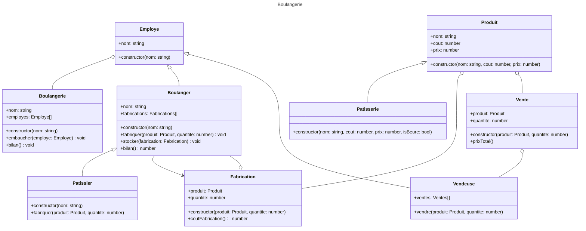

# Diagramme de classes
> Information : Ce diagramme utilise la notation "Mermaid" en markdown. Il devrait s'ouvrir sans problème sous Visual Studio Code Plus. d'information ici : https://mermaid.js.org/syntax/classDiagram.html

<!-- note "From Duck till Zebra"
    Animal <|-- Duck
    note for Duck "can fly\ncan swim\ncan dive\ncan help in debugging"
    Animal <|-- Fish
    Animal <|-- Zebra -->

Informations :
- `+` : Public
- `-` : Private
- `#` : Protected